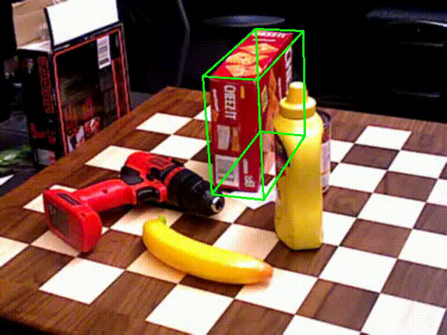
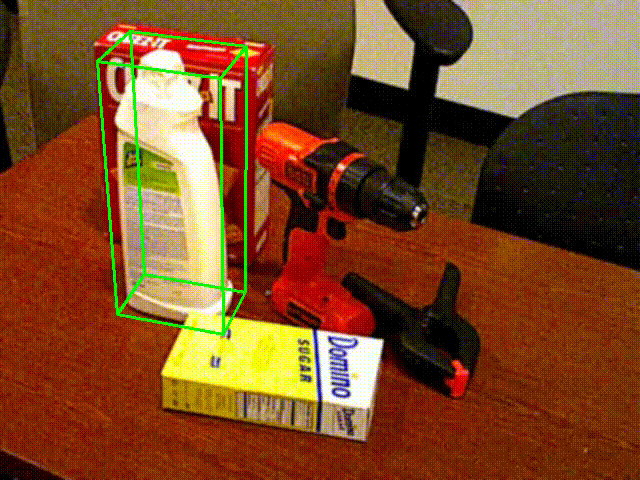
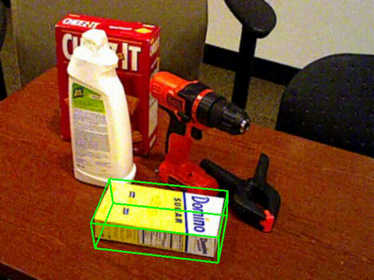
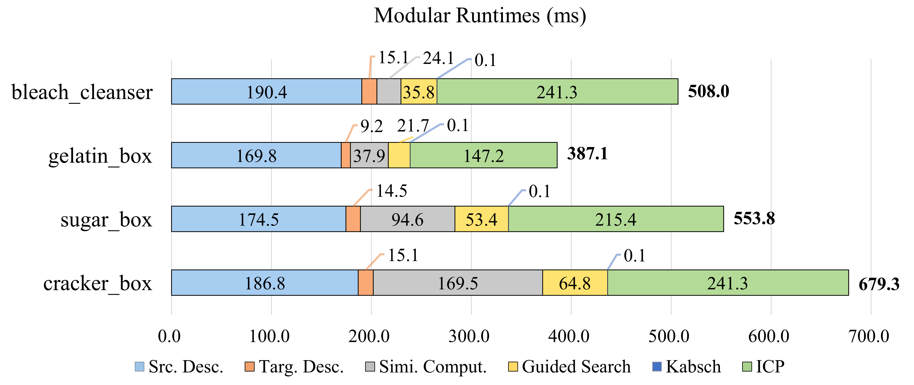

# GMatch - a GPU-free feature matcher for RGBD-based 6DoF pose estimation

<details>
<summary> PERFORMANCE </summary>

<p align="center">
    
    
    
</p>

Below is **modular runtimes** of our pose estimation pipeline on Ubuntu20.04-WSL with i5-12400F CPU and 8GB memory. 
ICP refiner is optional and the SIFT description results for source images can be cached when tracking.
However, you may need a preprocessing module with a object detection network or OpenCV to get ROI (otherwise, `Targ. Desc.`, `Simi. Comput`. and `Guided Search` may take much more time than the results reported here).

<div align="center"></div>

</details>


## 1. Introduction

This repository implements GMatch and the pose estimation pipeline built upon it. Related code files are explained below.
- `gmatch.py`: implements geometrically constrained feature matching with ORB/SIFT descriptor, where `gmatch.search()` performs guided search as described in our paper and `gmatch.Match()` is its wrap-up to match each of source images to the target image for pose estimation.
- `util.py`: provides dataclass `MatchData` for passing arguments and storing match result, `Solve()` for solving pose from match result, `Refine()` for ICP refinement, and visualization codes, etc.
- `demo.py`: demonstrates the whole pose estimation pipeline built upon GMatch, from data preparation to the final estimated pose. 

## 2. Installation

There ain't many dependencies of GMatch and most of them are for visualization purpose. Use following command to install them.
```
pip install -r requirements.txt
```

## 3. Usage
We provide `demo.py` for demonstration purpose. You can run it with
```
python demo.py
```

> **Note:** To understand how to use GMatch for pose estimation, we strongly recommend you to read `demo.py` line by line.

In brief, it first renders from six views to get images and point clouds as source, followed by loading RGB-D images as target. Then it formats the data to put them into `MatchData` and pass this to `gmatch.Match()`. Finally, with the match result stored in `MatchData`, `util.Solve()` (and optional `util.Refine()`) gives the estimated object pose w.r.t scene camera coordinate system.

We also put some visualization codes into `demo.py` so that you can see how each part goes.


## 4. Reproduction of Paper Results
To get HOPE and YCB-Video datasets on BOP platform, follow the instructions in https://bop.felk.cvut.cz/datasets/. Since our method is zero-shot, training images can be ignored safely. After download and unzip, you should get files like that:
```
.
├── dataset_info.md
├── models/
├── models_eval/
├── test/
├── test_targets_bop19.json
...
```
After that, create a directory named `bop_data` and put datasets there such that `hope` can be accessed via `./bop_data/hope`.
To test different combination of NN/GMatch/LightGlue and SIFT/ORB/SuperPoint, use `git checkout <TAG_NAME>` and `python main.py`. Available tags can be listed by `git tag -l`.

> **Note:** To play with LightGlue or SuperPoint, you have to install lightglue as in https://github.com/cvg/LightGlue.git

> **Note:** To test GMatch-ORB, you should not only `git checkout GMatch-ORB`, but also uncomment lines below `""" ORB settings """` and comment lines below `""" SIFT settings """` in gmatch.py.


## Tips
- To render depth (e.g. `get_snapshot()`), it's recommended to `export LIBGL_ALWAYS_SOFTWARE = 1`. In RTX4060 + Ubuntu20.04-WSL, Hardware rendering leads to abnormal depth.
- Codes below `""" visualization """` or `""" <Tune> xxx """` can be safely commented/uncommented to see how's the program going.
